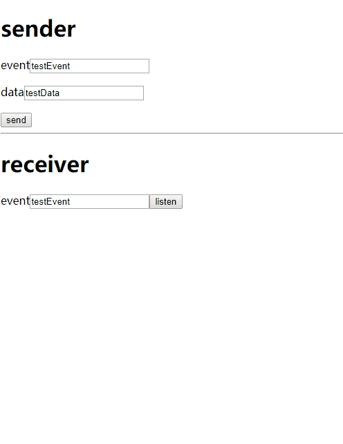

# sse-notify-suite

server and client for easy SSE notification | 让SSE通知更容易使用的服务端和客户端API

## client api | 客户端

### publish | 发布

```
import { Publisher } from 'sse-notify-suite'

let publisher = new Publisher('http://localhost:3000')

publisher.publish('hello', 'world')
// will send { event: 'hello', data: 'world' }
```

or pure http | 或纯http

```
curl -d "event=hello&data=world" -X POST http://localhost:3000/publish
```

### subscribe | 订阅

```
import { Subscriber } from 'sse-notify-suite'

let subscriber = new Subscriber('http://localhost:3000')

subscriber.on('hello',(data)=>console.log(data))
//'world'
```

or native EventSource | 或原生 EventSource

```
var es = new EventSource('/stream') 
es.addEventListener('hello', function (data) {
  console.log(data)
  //MessageEvent ....
})
```

## server | 服务端

```
npm i sse-notify-suite -g

# default port 3000
sse-notify-server

# or specify port through env
PORT=3001 sse-notify-server
```

or docker

```
docker run -p 3000:3000 -it --rm postor/sse-notify-server
```

## more | 更多

subscrib | 订阅

```
let subscriber = new Subscriber('http://localhost:3000')

subscriber.on(event,callback)

// unregister callback | 取消一个 callback 的注册
subscriber.off(event,callback)

// unregister all callback for event | 取消 event 的注册
subscriber.off(event)

// unregister all | 取消所有注册
subscriber.off()

// unsubscribe | 停止订阅
subscriber.unsubscribe()

```

sse router

```
import express from 'express'
import router from 'sse-notify-suite/router'

const app = express()

app.use('/', router)
```

run code example | 运行代码示例

```
git clone https://github.com/postor/sse-notify-suite
cd sse-notify-suite/examples/nextjs-docker
docker-compose up -d
```

open http://127.0.0.1:3000



